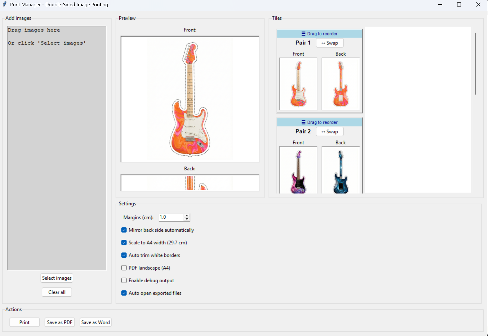

# Print Manager

Print Manager is a Python GUI tool for double-sided printing of image pairs on A4.

## Features

- Drag & drop image import
- Automatic front/back pairing
- Large preview and tile view
- Double-sided printing with optional mirroring
- PDF export
- Word (.docx) export
- A4 scaling with preserved aspect ratio
- Adjustable margins
- Auto-trim of white borders (optional)
- Debug output

## Quick Start

### Windows
Double-click `start.bat`. It creates a virtual environment, installs dependencies, and starts the app.

### Linux/Mac
```bash
chmod +x start.sh
./start.sh
```

### Manual
```bash
python -m venv .venv
source .venv/bin/activate
pip install -r requirements.txt
python druckmgr.py
```

## Documentation

See `USER_GUIDE.md` for a full user guide and settings reference.

## Screenshot



## Supported Formats

- PNG, JPG, JPEG, GIF, BMP

## Dependencies

- Pillow
- reportlab
- python-docx
- tkinterdnd2
